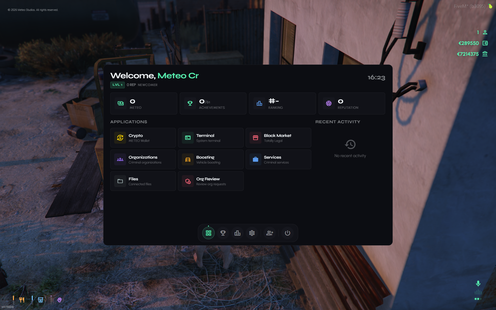

# Meteo Crime Tablet

This is a guide about testing the Meteo V2 crime tablet script designed exclusively for the Meteo V2 package. This is the tablet connected to all of our crime scripts and group system and more features you wont believe.


Get access to our exclusive video testing guide on Discord to see all of this in action.



Try it yourself for free on our showcase server. [See here to get access](../../how-to/how-to-access-showcase-server.md).


***

## Before You Start

* Access to the meteo showcase server
* Know how to [spawn items](../../how-to/how-to-spawn-items.md)
* Familiar with [getting started](../../getting-started.md) basics

***

## Getting the Tablet



#### Teleport to the Location

Lets go to `/tp 901.9095, 3556.9412, 33.8196` and teleport



#### Get the Tablet

Point target and talk to him. You can buy the crime tablet from him for $2500 cash. Or you can spawn it using `/giveitem yourid meteo_crimetablet 1` or admin menu



#### Open the Tablet

Put your tablet to hotbar slot and open it



#### Set Your Crime Name

Enter a suitable crime name you want. Also this is possible to change later too



#### Explore Features

Check out all those things the tablet have. Make sure to check the exclusive testing video to get to know about all features

<figure><figcaption></figcaption></figure>




Also please note make sure you dont have 2 tablets in the inventory. Otherwise it will not work properly


***

## Testing Tablet Features

### Crypto



#### Add Test Crypto

Since we are testing lets just test the crypto and name change. First use `/addcrypto 50000`



#### Check Crypto

Open the tablet again after adding crypto. You can see the crypto. Go to crypto app and check out that



#### Test Name Change

Now go to settings and change your name and again go to crypto and see the transaction history and also amount must be removed from the full amount




`/addcrypto 50000` is an admin command. Check [test-commands](test-commands.md) for more info


### Achievements



#### Collect Achievements

Go to achievements and collect those newly unlocked achievements



#### Test All Achievements

Also if you really need to check whats happening after complete all achievements use `/setachievement all` command on chat and see lol. Now you can collect them forever lol



#### Refresh Tablet

After collecting all achievements close and open tablet so it will refresh with all crypto




`/setachievement all` only works on the showcase server. Dont get confused later


### Profile

* Also you can add profile pic and change name

### Blackmarket



#### Get a Rare Item

This is a feature of this crime tablet. Spawn rare item like `meteo_hqtable`. Use giveitem or admin menu



#### Create a Post

Go to blackmarket app and create post hq table on blackmarket. So other players can buy them and you will get crypto



#### Test Buying

Also try Buy from Shop and see if its showing correctly on map and get from the ped



### Data File Exchange

* Go to `/tp 1469.9124, 6550.4980, 14.9041` and talk to The Fence
* You can sell a `meteo_datafile` for cash (you pay a small crypto fee) or trade it straight for crypto with no fee
* You get data files from [meteo-atmskimming](../meteo-atmskimming/)

### Groups

* You can see the group option on navbar of the tablet. You can either create one or join with an invite from a leader. Pretty simple
* Also this is built with all validations and auto group locking, player dead handling, logout handling all those possible scenarios :) to ensure your players will not get any issues ;)
* Nice. Check out groups and rankings with the testing video

### Terminal

* The terminal is where you run commands for things like atm skimming, boosting gps hack, vin scratch etc
* You can use commands like `ls` to list files, `cat` to read file contents, and create new files
* Check out the other crime script testing guides to see what terminal commands they use

### Services

* Go to services app to see all available crime services you can purchase with crypto
* Things like loose change, high speed drops, house robbery, vault jobs, hunts and more
* Check out their individual testing guides for how to use each one

***

## Also Check These Crime Scripts

Please check these other scripts since they all use the crime tablet. Each has their own testing guide:


[meteo-racing](../meteo-racing/)



[meteo-boosting](../meteo-boosting/)



[meteo-loosechange](../meteo-loosechange/)



[meteo-hsd](../meteo-hsd/)



[meteo-atmskimming](../meteo-atmskimming/)



[meteo-organizations](../meteo-organizations/)



[meteo-vaultjob](../meteo-vaultjob/)



[meteo-transporthunt](../meteo-transporthunt/)



[meteo-seahunt](../meteo-seahunt/)



[meteo-foresthunt](../meteo-foresthunt/)



[meteo-bargehunt](../meteo-bargehunt/)



[meteo-houserobbery](../meteo-houserobbery/)


***

## Good to Know


Black market fees and listable items, shop stock and restock time, data exchange payouts, tablet price, crypto settings and the name change fee are all editable in-game from **Script Settings** in the admin menu ([meteo-manage](../meteo-manage/)) - no code editing needed, and your changes survive script updates. Add or edit black market delivery drop points, the data file buyer and the tablet seller in-game with the Crime Tablet creator.

