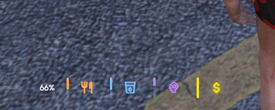
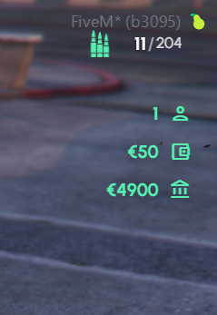

# Meteo HUD

This is a guide about testing the Meteo V2 hud script designed exclusively for the Meteo V2 package. This hud got a major update - buff and debuff indicators, healing animations, a detailed vehicle hud for every vehicle type, a money hud and perk XP notifications. Every element can be moved, scaled and hidden in game and your layout is saved per character. It is connected with our scripts like meteo-buffs, meteo-perks, meteo-medicaljob, meteo-fuel, meteo-phone and meteo-dailyrewards (economy boost).


Get access to our exclusive video testing guide on Discord to see all of this in action.



Try it yourself for free on our showcase server. [See here to get access](../../how-to/how-to-access-showcase-server.md).


***

## Before You Start

* Access to the meteo showcase server
* Know how to [spawn items](../../how-to/how-to-spawn-items.md)
* Familiar with [getting started](../../getting-started.md) basics

***

## Testing HUD



**Status Display**

Health and armor sit on the bottom left with hunger and thirst as lines under them. Stress, oxygen and other statuses only show up when they matter. The vitals fade when nothing changes and come back on any change. Use `/hudsettings` on chat to open the settings menu and turn things on or off as you want

<figure><figcaption></figcaption></figure>

<figure><figcaption></figcaption></figure>




**Buff and Debuff Indicators**

Spawn and use some items like `/giveitem yourid beer 1` or `/giveitem yourid meteo_taco 1`. The effect name pops up beside the vitals and then flies into the effects row. Buffs sit on one side and debuffs on the other, and timed ones drain on their own. Cravings show as a badge too. Check out [meteo-buffs](../meteo-buffs/) for more info



**Healing and Bleeding**

Get hurt and use a medical item like a bandage. While it heals you see a striped healing preview on the health bar. When you are bleeding the heart beats in the health pill. Check out [meteo-medicaljob](../meteo-medicaljob/) for the medical items



**Money HUD**

Your cash, bank balance and player ID show on the HUD. Spend or earn some money and see it update. You can hide each of them from `/hudsettings`



**Perk Notifications**

Do any activity that gives perk XP (pickpocketing, a job task, a gym set and so on). A toast shows the XP gained and your progress, and a level up shows its own toast. Check out [meteo-perks](../meteo-perks/) for more info



**Crosshair and Ammo**

Get `/giveitem yourid weapon_pistol 1` or any weapon and aim. You will see our crosshair which reacts to movement, shots and hits. Sniper rifles use our own scope

When you shoot the ammo count updates on the HUD



**Voice**

Talk and the voice indicator animates with your voice. Use **\`** (backtick) on keyboard to change voice range. Also connect to radio and see the voice icon change to the radio icon



**Vehicle HUD**

Spawn a vehicle using `/car adder`. The vehicle hud shows speed, gear, RPM, fuel and an indicator column for lights, engine, lock, seatbelt and cruise. Drive fast without a seatbelt and you get a reminder, and you get an alert when fuel is low

Try a motorbike, bicycle, boat, plane and helicopter too. Each type gets its own layout, and boats and aircraft read in knots



**Cruise Control and Speed Limiter**

While driving press **Y** to toggle cruise control at your current speed, and **U** to set the speed limiter. Both can be rebound in GTA key bindings



**Edit Layout**

Use `/hudedit` to move, scale and show or hide every part of the HUD. You can snap to grid, reset single elements or everything, and drag where your phone peeks. Save and it is stored on your character



**Cinematic Mode**

Use `/cinematic` to hide the HUD and show black bars. Use `/reloadhud` if you ever need to soft reload the HUD



**Economy Boost**

For checking out meteo economy boost check [meteo-dailyrewards](../meteo-dailyrewards/) testing guide



***

## Good to Know


Default layout, crosshair, cruise control, speed limiter, seatbelt and low fuel alerts, minimap and keybinds are configurable on our config. You can change them once you get the package. We will guide you :)


* Players can change their own HUD layout and preferences in game and they are saved per character
* Speed unit (mph or km/h) and currency symbol follow the server settings
