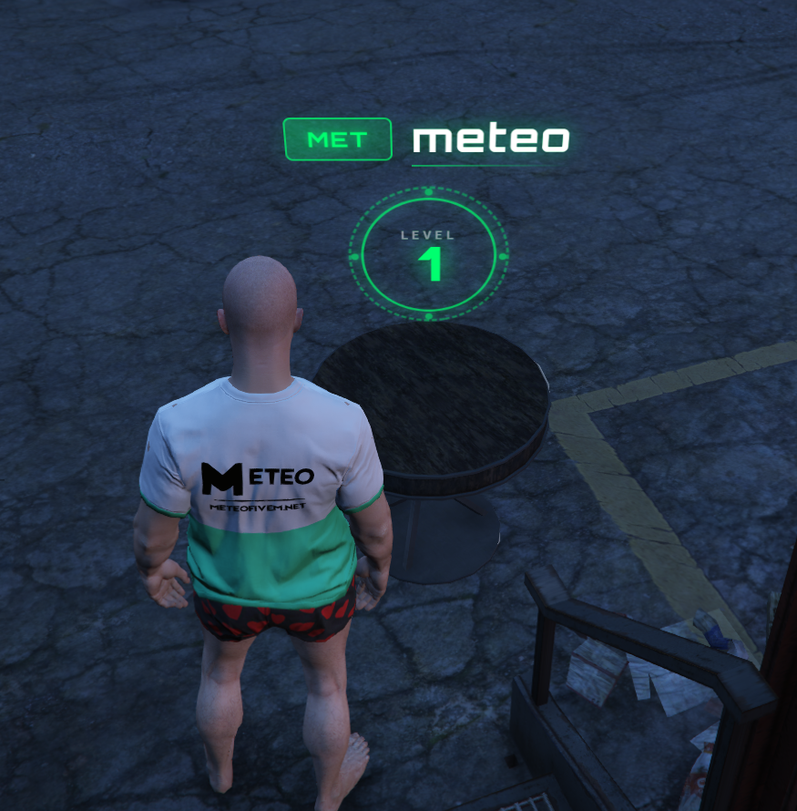
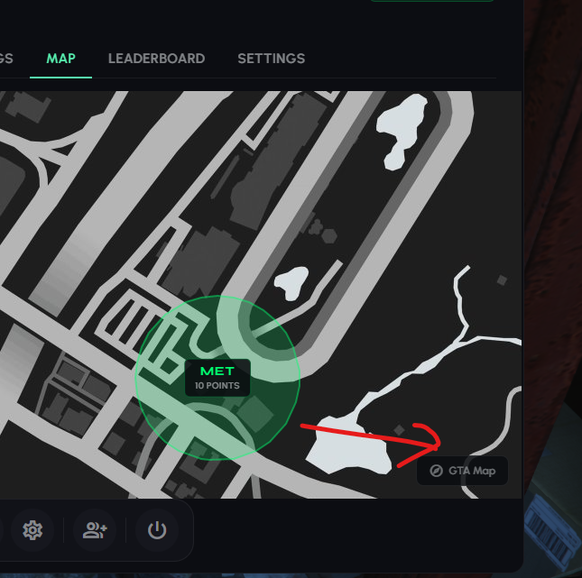

# Meteo Organizations

This is a guide about testing the Meteo V2 crime organizations script designed exclusively for the Meteo V2 package.


Get access to our exclusive video testing guide on Discord to see all of this in action.



Try it yourself for free on our showcase server. [See here to get access](../../how-to/how-to-access-showcase-server.md).



Make sure to check out [meteo-crimetablet](../meteo-crimetablet/) testing guide before checking this.


***

## Before You Start

* Access to the meteo showcase server
* Know how to [spawn items](../../how-to/how-to-spawn-items.md)
* Familiar with [getting started](../../getting-started.md) basics

***

## Testing Organizations

### Creating an Organization



#### Create Org

Open tablet and go to the organizations app. On there you can go to create organization option and create one (costs 750 MTC)



#### Accept Org (Admin)

After creating go back and open org review app. Only admins can see this app (this is only for admins and also you can disable this process if you do not want). So go to org review app and accept your organization



#### View Org

Now go to organization app again and see all org things




If you do not have crypto use `/addcrypto 5000` command and get crypto. This command only works on the showcase server. Check out [crimetablet](../meteo-crimetablet/) testing guide for more info


### Treasury and Upkeep

* Go to TREASURY and deposit some crypto :)
* First pay the upkeep. Upkeep is due every 14 days and costs more as your org levels up. If you miss it your org can be downgraded
* Add members as you want and check them too. You start with 8 member slots and can buy upgrades up to 24. Each invite costs 100 MTC from the treasury

### Profile and Management

* You can set profile images and also transfer ownerships and also delete organization too
* Ranks are Leader, Veteran and Member. Only the leader can withdraw from the treasury

### Setting Up Headquarters



#### Get a Property

You need a MLO property owned suitable for the organization. Check out [meteo-properties](../meteo-properties/) testing guide to create one and buy :)



#### Get HQ Table

Now go to that property and get `meteo_hqtable` item using admin menu or `/giveitem yourid meteo_hqtable 1`. For normal players can get this item from crafting and doing crime hunts and with crates



#### Place HQ Table

Now open furnishing menu and search hq and place the hq table



#### Set HQ on Tablet

Now open tablet and set hq. It will show your property name and select that and set as hq



#### Verify on Map

Now you can see your org on the map with correct location :) Also you can see the org level hologram showing on top of the hq table. Cool visual to showcase your org :)

<figure><figcaption></figcaption></figure>




### Org Map

* On tablet org map you can toggle gta map blip too and see the radius on the normal map
* Also you can turn it off using gta map btn on tablet map

<figure><figcaption></figcaption></figure>

### Territory and Spray Marking



#### Spray Territory

Get `marking_spray` and spray and get points and manage your territory. Also this is limited so yes we have limitations too



#### Benefit from Territory

With increasing radius they can sell drugs on their territory and gain more xp to org and earn more cash. Check out [meteo-drugselling](../meteo-drugselling/) testing guide for selling drugs on your territory



> This is also connected with [meteo-scenes](../meteo-scenes/) for spray marking territory

### Org Services

* With organization you can unlock services like Forest Hunt, Transport Heist, Barge Hunt
* These need org level requirements. Refer to their testing guides to do them :)

### Level Perks

* Your org unlocks passive perks as it levels up. Right now these boost drug sale cash on your territory - +5% at level 1, +10% at level 3, +15% at level 6 and +20% at level 9
* You can see them in the Upgrades tab on the tablet


Use `/setorglevel xp 2000` to level up for testing. This command only works on our showcase server. Check [test-commands](test-commands.md) for more info


***

## Good to Know


All organization settings, creation fee, ranks, levels, upkeep costs, member upgrades, level perks, territory limits and HQ settings are configurable on our config. You can change them once you get the package. We will guide you :)


> Connected with [meteo-perks](../meteo-perks/). If you have **Hustler** specialization - Turf Control gives +70% org rep from drug sales on your territory


[meteo-crimetablet](../meteo-crimetablet/)



[meteo-scenes](../meteo-scenes/)



[meteo-drugselling](../meteo-drugselling/)



[meteo-properties](../meteo-properties/)

