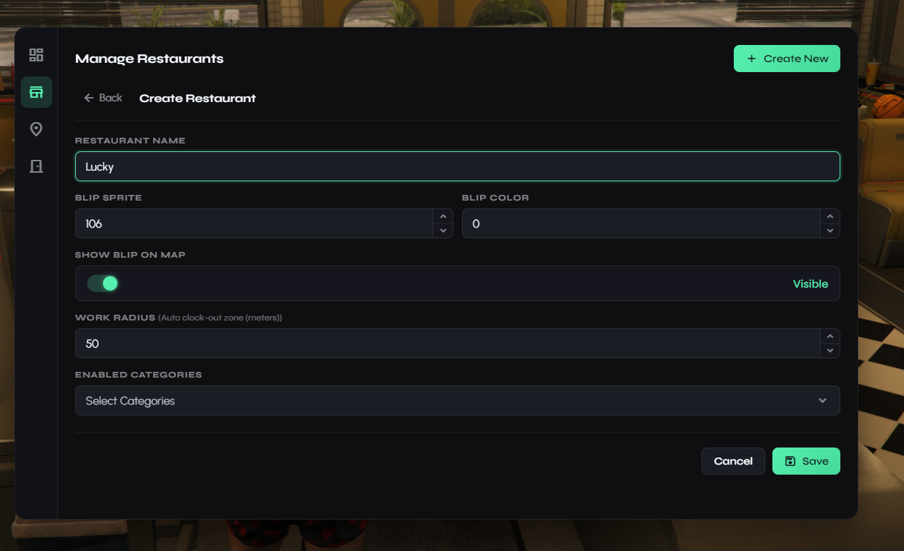
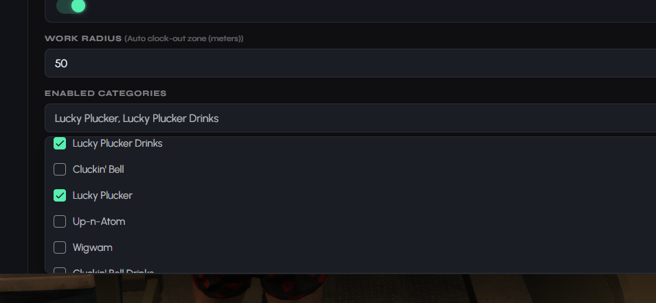

# Meteo Restaurants

This is a guide about testing the Meteo V2 restaurant script with ingame creator designed exclusively for the Meteo V2 package.


Get access to our exclusive video testing guide on Discord to see all of this in action.



Try it yourself for free on our showcase server. [See here to get access](../../how-to/how-to-access-showcase-server.md).


***

## Before You Start

* Access to the meteo showcase server
* Know how to [spawn items](../../how-to/how-to-spawn-items.md)
* Familiar with [getting started](../../getting-started.md) basics

***

## Creating a Restaurant (Admin)

* Use `/restdev` command on chat to open the restaurants admin menu (admin only)
* The **Restaurants** page lists every restaurant with its own page (setup state, owner, stations, doors and teleport). The **Creator** page is where you build new restaurants for your new mlo. For our current mlos we already made them for you, so you dont have to create them again
*

    <figure><figcaption></figcaption></figure>

### When Creating Restaurant

The creator is a five step page: Basics, Menu, Stations, Doors and Review.



#### Basics

Give the restaurant a name (at least 3 characters) and set the WORK RADIUS (auto clock-out zone in meters). You can also set the map blip sprite and colour using the ids from <a href="https://docs.fivem.net/docs/game-references/blips/" target="_blank">https://docs.fivem.net/docs/game-references/blips/</a>



#### Menu

Select all categories this restaurant serves. This decides which recipes staff can cook and which stations you need to place next

<figure><figcaption></figcaption></figure>



#### Stations

Click add point and the menu hides so you can stand where the station belongs, then save the point. Required stations are marked. For example clock and manage, ingredients shop, kitchen storage, shop stash, personal locker, process station, cooking station, drink station, order counter and the application ped. You can add more than one of each



#### Doors

Optionally aim at a single or double door and name it. Only clocked in staff can open these doors



#### Review

Check everything that will be saved and fix any problems shown, then click create restaurant




Stations and doors are saved onto a restaurant, so the restaurant has to be created first before you can place them.


### Transfer

* On the **Transfer** page you can export restaurants as a bundle (settings, stations and doors) and import one on another server, with a dry run first
* You can also keep named bundles as presets

***

## Setting Yourself as Owner



Go to the **Restaurants** page and find the restaurant you created



Click set owner and put your id (use `/id` if you dont know)



Then you will be able to access and manage the restaurant like owner and hire players do anything you want



***

## Testing the Restaurant

### As Owner/Manager

* Clock in at the clock location
* Open the manage menu from the clock location, or use `/restmanage` while you are inside a restaurant you can manage
* The manage menu has dashboard, live orders, order history, prices, shop, employees, applications, work logs, banking and settings
* Hire employees and set their grades:
  * **Employee** (grade 0) - $50 paycheck, can cook and take orders
  * **Supervisor** (grade 1) - $75 paycheck, can clock others in/out
  * **Manager** (grade 2) - $100 paycheck, can hire/fire, view earnings, set commissions
  * **Owner** (grade 3) - full access to everything
* Set commission rate (5% to 25%, default 15%)

### Applications

* Players can walk up to the application ped and apply to work at the restaurant
* Review, accept or reject applications from the applications tab on the manage menu

### Cooking and Serving



Buy ingredients from the ingredients shop location



Go to process station to process items (chop, grind, blend)



Go to cooking station to cook items (grill, fry, bake, assemble)



Go to drink station to make drinks (pour, brew, mix)



Take orders from the order counter. Orders show up on the live orders board (pending, preparing, ready)



Check the shop stash to sell items to customers



### Also Make Sure to

* Check all unique items that are on the restaurants. There are more than 50 custom made unique items
* Test the work zone auto clock-out (if you go too far from restaurant you get clocked out)
* Test paycheck system (pays every 10 minutes by default)
* Check the employee menu as a normal employee (my shift, live orders, order history, my earnings and my work logs)
* Restaurants show up in the meteo-phone services directory, and calls to their line ring the staff who are clocked in

***

## Watch the Exclusive Guide Video

> Watch the exclusive guide video to see all advanced features and try them by yourself

***

## Good to Know


Restaurants, their stations, doors and application peds are all editable in-game from **Script Settings** in the admin menu ([meteo-manage](../meteo-manage/)) through the restaurant creator - no code editing needed, and your changes survive script updates. Employee grades, paychecks, commission rates and storage sizes are configurable on our config. You can change them once you get the package. We will guide you :)



[meteo-phone](../meteo-phone/)

