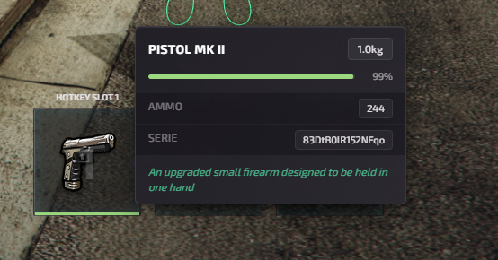

# Meteo Weapon Repair

This is a guide about testing the Meteo V2 weapon repair script designed exclusively for the Meteo V2 package.


Get access to our exclusive video testing guide on Discord to see all of this in action.



Try it yourself for free on our showcase server. [See here to get access](../../how-to/how-to-access-showcase-server.md).


***

## Before You Start

* Access to the meteo showcase server
* Know how to [spawn items](../../how-to/how-to-spawn-items.md)
* Familiar with [getting started](../../getting-started.md) basics

***

## Testing Weapon Repair



#### Get a weapon and damage it



Get weapon using `/giveitem yourid weapon_pistol_mk2 1` or use meteo admin menu. Use the weapon till its health is lower. You can see the weapon health on inventory when hovering on weapon item.

<figure><figcaption></figcaption></figure>



#### Go to repair location



Use `/tp 2409.2043, 3031.5886, 48.1526` on chat to teleport to the default bench.



#### Store the weapon



Point target at the repair bench and open storage. Put the weapon to that slot (you can repair 2 weapons at a time - this is configurable). Your repair storage belongs to you, so you can take your weapons back out at any repair bench.



#### Check repair cost



Point target and use repair weapon option. This will show what materials and cost you need to repair the weapon. Repair cost is $500 per weapon. Materials needed: plastic, metalscrap, copper, aluminum, steel, rubber (2 to 4 items needed depending on damage).



#### Get the materials



Usually they are materials which players can find on scrap and dumpsters like doing those activities. You can open admin menu using **F9** and spawn those items. Or use commands like `/giveitem yourid metalscrap 5`, `/giveitem yourid plastic 5` etc.



#### Repair the weapon



After that confirm repair and do the minigame and finish it. The skill check has 3 rounds with mixed difficulty (easy, medium, hard). If you fail you keep your materials - just try again. Finally open storage again and get the repaired weapon.




The `/giveitem` and `/tp` commands are only available on our showcase server so you can quickly get materials and teleport.


***

## Good to Know


Repair cost, repair time, materials, skill check rounds and difficulty, the repair animation and perk XP are all editable in-game from **Script Settings** in the admin menu ([meteo-manage](../meteo-manage/)) - no code editing needed, and your changes survive script updates. Add or edit repair benches in-game with the Weapon Repair creator (name, bench model, position and map blip).

