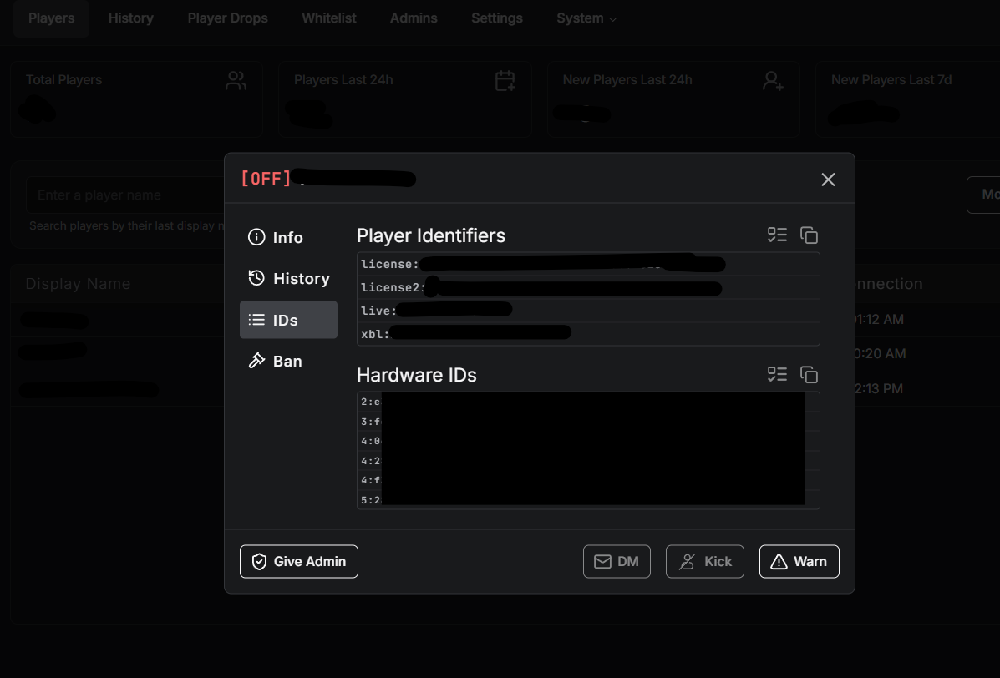

# How to Add Admins

Admin permissions are set in `permissions.cfg`. You can use a player's Discord ID or their license identifier.

***


The server runs on **Qbox**, so admins use the `group.admin` and `group.mod` permissions.


## Permission Levels

| Permission    | Who it's for                                                                                |
| ------------- | ------------------------------------------------------------------------------------------- |
| `group.admin` | Owners - full access to everything, all admin commands and every meteo script admin feature |
| `group.mod`   | Staff admins - access to meteo script admin features (admin menu, vehicle spawn, etc.)       |

By default both groups can use the meteo scripts' admin features. You can change which group each script uses - see [How to Change Script Permissions](how-to-script-permissions.md).

***

## Getting a Player's Identifier

You need either their **Discord ID** or **license identifier** to add them.



**Discord ID**

Right click the player in Discord → **Copy User ID** (make sure Developer Mode is on in Discord settings)



**License identifier via txAdmin**

Open **txAdmin** → go to **Players** → search and select the player → scroll to **Player Identifiers** → copy the `license:` value from there

<figure><figcaption></figcaption></figure>



***

## Adding an Owner

Use `group.admin` for the server owner. Owners have full access to everything.

**Using Discord ID:**

```
add_principal identifier.discord:YOUR_DISCORD_ID group.admin
```

**Using license:**

```
add_principal identifier.license:YOUR_LICENSE_HERE group.admin
```

***

## Adding a Staff Admin

Use `group.mod` for staff admins. They get the meteo scripts' admin features.

**Using Discord ID:**

```
add_principal identifier.discord:YOUR_DISCORD_ID group.mod
```

**Using license:**

```
add_principal identifier.license:YOUR_LICENSE_HERE group.mod
```

***

## Example

```
# Owner
add_principal identifier.license:xxxxxxxxxxxxxxxxxxxxxxxxxxxxxxxxxxxxxxxx group.admin

# Staff admins
add_principal identifier.discord:000000000000000000 group.mod
add_principal identifier.license:xxxxxxxxxxxxxxxxxxxxxxxxxxxxxxxxxxxxxxxx group.mod
```


After editing `permissions.cfg` you need to restart the server for changes to take effect.


***

## Want different groups per script?

Each meteo script decides which groups can use its admin features in its own `sv_permissions.lua` file. You can point a single script at a custom group without touching the others.


[How to Change Script Permissions](how-to-script-permissions.md)

