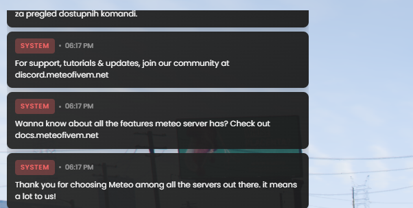
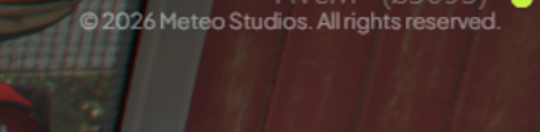

# How to Remove Acknowledge Messages

By default, the meteo server prints a few welcome/info messages in chat and the console (links to our Discord, docs, and a thank-you message). If you do not want these to show on your server, you can turn them off with one config line.

***

## Steps



**Open `meteo.cfg`**

Find the `meteo.cfg` file in your server config folder and open it.



**Find the acknowledge line**

Look for this line:

```
setr meteo:acknowledge true
```



**Change it to `false`**

```
setr meteo:acknowledge false
```



**Restart the server**

The default chat messages and console prints will no longer appear.



***

## What gets disabled

The chat messages shown below (and matching console prints) will no longer be sent on server start:

<figure><figcaption><p>Default acknowledge messages shown in chat</p></figcaption></figure>

The on-screen copyright text is removed as well:

<figure><figcaption><p>Copyright text shown on screen</p></figcaption></figure>

***